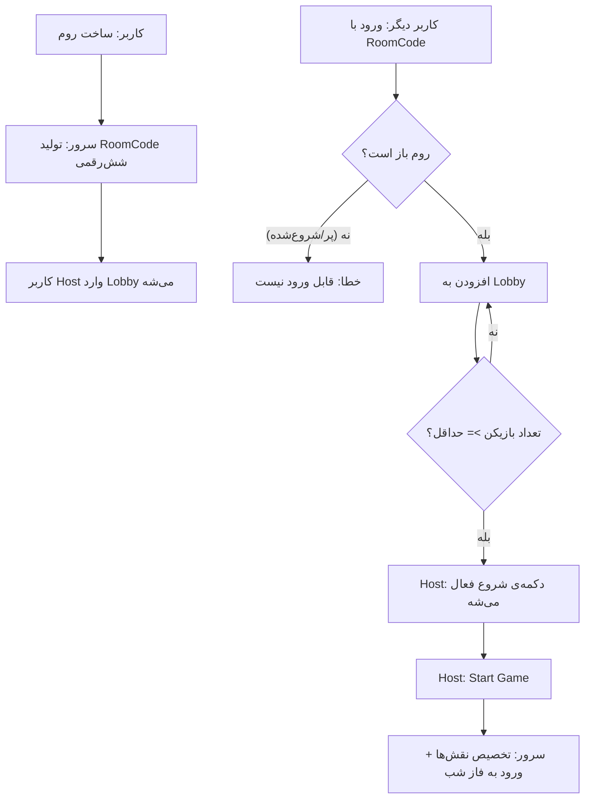
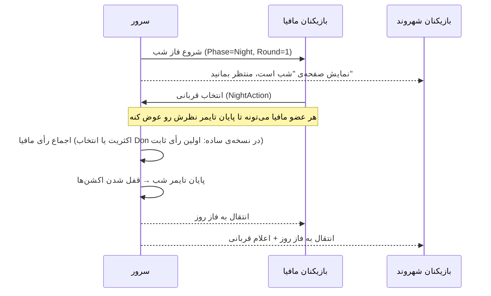
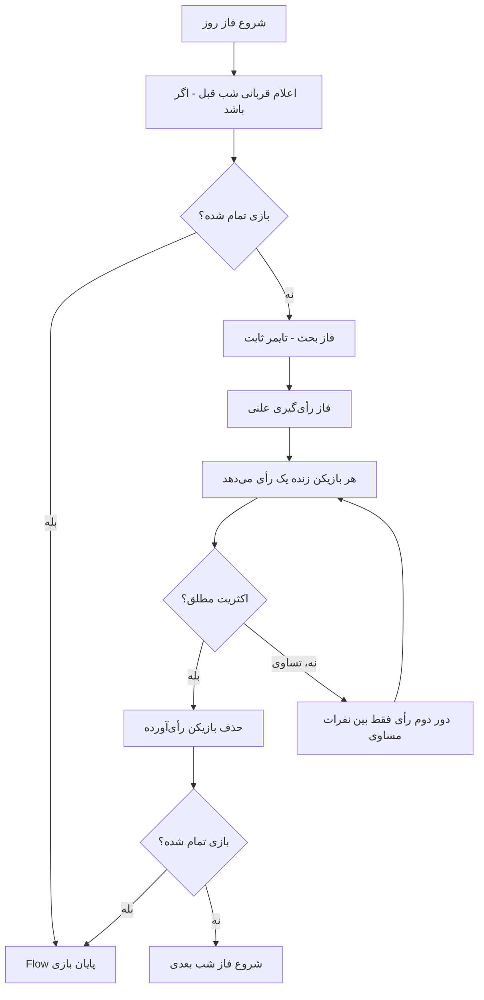
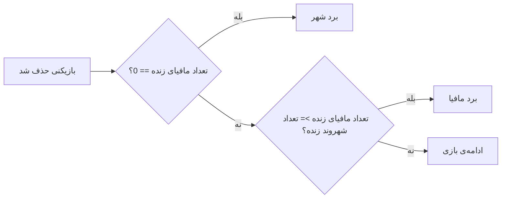
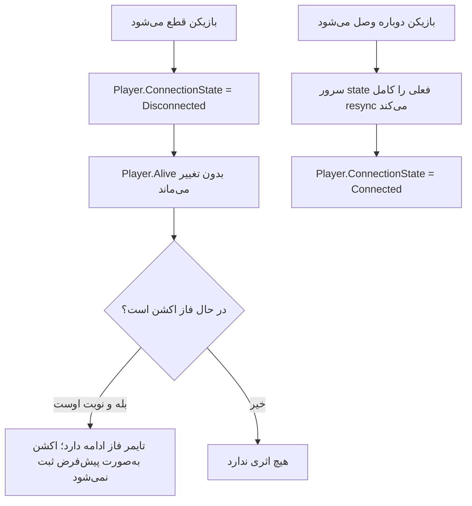
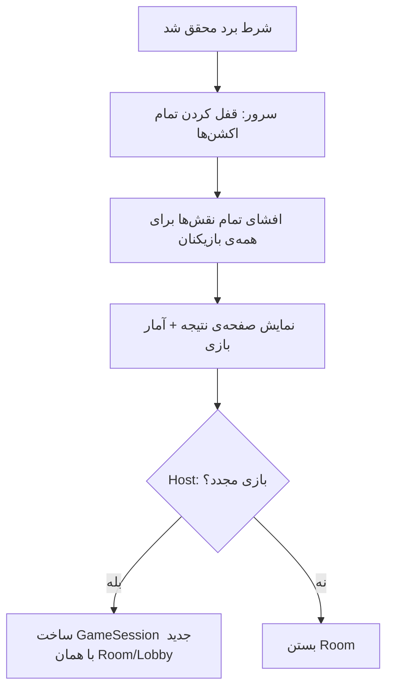

# Work Flow ها — بازی مافیا (v1: مافیای روسی)

*نوشته‌ی لیلا (BA)*

## ۱. Flow ساخت و ورود به روم

**قوانین سیستمی:**
- حداقل بازیکن برای «مافیای روسی»: ۶ نفر (نسبت پیشنهادی مافیا:شهر ≈ ۱:۳)
- فقط Host می‌تونه بازی رو استارت کنه
- بعد از Start، RoomCode دیگه قابل‌استفاده برای ورود نیست (Room.Status = InProgress)

---

## ۲. Flow فاز شب (فقط شب اول — طبق قانون سناریو)

**قوانین سیستمی:**
- تایمر پیش‌فرض فاز شب: ۴۵ ثانیه
- اگه مافیا هیچ انتخابی نکنه تا پایان تایمر → هیچ‌کس نمی‌میره (no-kill night)
- از شب دوم به بعد: فاز شب صرفاً یک «مکث نمایشی» کوتاهه، اکشن کشتن غیرفعاله (طبق قانون سناریوی مافیای روسی)

---

## ۳. Flow فاز روز و رأی‌گیری

**قوانین سیستمی:**
- رأی روز **علنیه** — هر بازیکن می‌بینه کی به کی رأی داده (برخلاف اکشن شب که مخفیه)
- تساوی در دور دوم هم اگه ادامه پیدا کنه → آن روز کسی حذف نمی‌شه (skip)

---

## ۴. Flow بررسی شرط پایان بازی

بعد از **هر** حذف بازیکن (چه در شب، چه در روز) این چک اجرا می‌شه:

---

## ۵. Flow قطعی اتصال و بازگشت (Reconnect)

**قوانین سیستمی:**
- قطعی اتصال هرگز باعث حذف خودکار از بازی نمی‌شه (جلوگیری از سوءاستفاده‌ی «قطع عمدی برای فرار از رأی»)
- اگه Host قطع بشه، مالکیت Host به‌صورت خودکار به نفر بعدی در Lobby منتقل می‌شه (فقط قبل از Start)

---

## ۶. Flow پایان بازی

