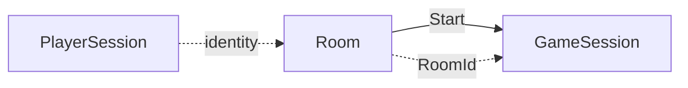
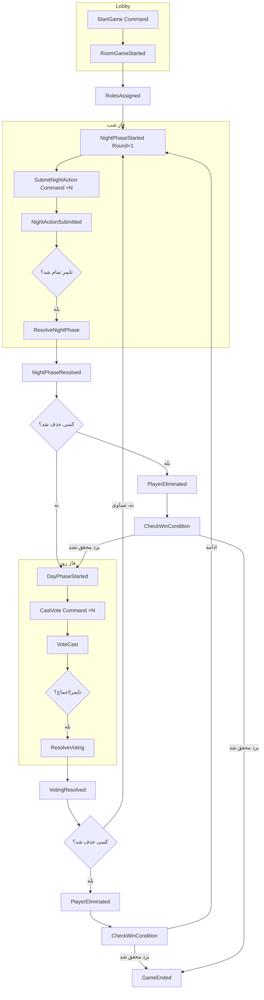

# مدل دامنه — Aggregate Root ها، Entity ها، Domain Event ها

*نوشته‌ی لیلا (BA)* — هم‌راستا با الگوی معماری Ahmad.OnlineShop (هر بخش: Aggregates / Entities / Enums / Events / Exceptions / Repositories).

## ۱. نقشه‌ی Bounded Context

سه Aggregate Root، هر کدوم مسئول یک بخش از چرخه‌ی عمر بازی:



| Aggregate Root | مسئولیت | چرخه‌ی عمر |
|---|---|---|
| **PlayerSession** | هویت مهمان (nickname + token) | از ورود تا خروج از سایت |
| **Room** | Lobby قبل از شروع بازی | از Create تا Start/Close |
| **GameSession** | State machine خود بازی (نقش، فاز، رأی) | از Start تا Ended |

> نکته‌ی طراحی: Room و GameSession دو Aggregate جدا هستن، نه یکی. قوانین (invariant) این دو کاملاً متفاوتن — Room درباره‌ی «کی مجاز به ورود»، GameSession درباره‌ی «کی مجاز به اکشن‌زدن»؛ قاطی‌کردنشون باعث می‌شد یک Aggregate هم مسئول Lobby باشه هم مسئول منطق شب/روز، که transaction boundary رو غیرضروری بزرگ می‌کنه.

---

## ۲. Aggregate: PlayerSession

**Entity ریشه:** `PlayerSession { PlayerId, Nickname, Token, CreatedAtUtc }`

| Command | Invariant | Event |
|---|---|---|
| `CreateGuestSession(nickname)` | nickname بین ۲ تا ۲۰ کاراکتر | `GuestSessionCreated` |

---

## ۳. Aggregate: Room

**Entity ریشه:** `Room { RoomId, RoomCode, HostPlayerId, Status, Members: List<RoomMember>, MinPlayers=6, MaxPlayers=15, CreatedAtUtc }`
**Entity فرزند:** `RoomMember { PlayerId, Nickname, JoinedAtUtc, IsHost }`
**Value Object:** `RoomCode` (۶ کاراکتر الفبا-عددی، case-insensitive)

### Invariant ها
1. `RoomCode` باید بین روم‌های `Open` یکتا باشه
2. تعداد اعضا هرگز از `MaxPlayers` بیشتر نشه
3. فقط وقتی `Status == Open` می‌شه Join کرد
4. فقط `HostPlayerId` می‌تونه `Start` بزنه
5. `Start` فقط وقتی تعداد اعضا `>= MinPlayers` باشه مجازه
6. اگه Host خارج بشه، مالکیت خودکار به قدیمی‌ترین عضو باقی‌مانده منتقل می‌شه

### Command ها → Event ها

| Command | Event(s) | Exception های محتمل |
|---|---|---|
| `CreateRoom(hostPlayerId)` | `RoomCreated` | — |
| `JoinRoom(roomCode, playerId, nickname)` | `PlayerJoinedRoom` | `InvalidRoomCodeException`, `RoomFullException`, `RoomAlreadyStartedException` |
| `LeaveRoom(roomId, playerId)` | `PlayerLeftRoom` (+ `HostTransferred` در صورت نیاز) | `PlayerNotInRoomException` |
| `StartGame(roomId, hostPlayerId)` | `RoomGameStarted` | `OnlyHostCanPerformActionException`, `NotEnoughPlayersException` |
| `CloseRoom(roomId, hostPlayerId)` | `RoomClosed` | `OnlyHostCanPerformActionException` |

> `RoomGameStarted` هندلری داره که یک `GameSession` جدید می‌سازه — این تنها نقطه‌ی اتصال بین دو Aggregate است (از طریق Domain Event، نه رفرنس مستقیم).

---

## ۴. Aggregate: GameSession

**Entity ریشه:** `GameSession { GameSessionId, RoomId, Status(Phase), Round, Players: List<GamePlayer>, PhaseDeadlineUtc, WinningTeam }`
**Entity فرزند:** `GamePlayer { PlayerId, Role, IsAlive, ConnectionState }`
**Entity فرزند:** `NightAction { ActorPlayerId, TargetPlayerId, SubmittedAtUtc }` (فقط تا پایان فاز شب زنده‌ست)
**Entity فرزند:** `DayVote { VoterPlayerId, TargetPlayerId, Round }`
**Value Object:** `Role` (enum قابل‌گسترش: `SimpleCitizen`, `SimpleMafia` در v1)
**Value Object:** `GamePhase` (enum: `Night`, `Day`, `Voting`, `Ended`)

### Invariant ها
1. اکشن شب فقط از نقش‌های دارای قابلیت شب پذیرفته می‌شه (v1: `SimpleMafia`)
2. اکشن/رأی فقط از بازیکن `IsAlive == true` پذیرفته می‌شه
3. اکشن شب idempotent است — ثبت مجدد جایگزین قبلی می‌شه، نه اضافه
4. بعد از قفل‌شدن فاز (`PhaseDeadlineUtc` گذشته)، هیچ Command ای پذیرفته نمی‌شه
5. بعد از هر `PlayerEliminated`، فوراً `CheckWinCondition` اجرا می‌شه
6. بعد از `GameEnded`، هیچ Command دیگه‌ای پذیرفته نمی‌شه (`GameAlreadyEndedException`)
7. `RevealedRoles` فقط در event نهایی `GameEnded` منتشر می‌شه — نه زودتر

### Command ها → Event ها

| Command | چه‌کسی مجازه | Event(s) | Exception های محتمل |
|---|---|---|---|
| *(داخلی، از `RoomGameStarted`)* `CreateGameSession` | سیستم | `RolesAssigned` → `NightPhaseStarted(Round=1)` | — |
| `SubmitNightAction(actorId, targetId)` | فقط `SimpleMafia` زنده | `NightActionSubmitted` | `ActionNotAllowedForRoleException`, `WrongPhaseForActionException`, `PlayerAlreadyEliminatedException` |
| *(داخلی، تایمر)* `ResolveNightPhase` | سیستم | `NightPhaseResolved` → `PlayerEliminated?` → `DayPhaseStarted` | — |
| `CastVote(voterId, targetId)` | بازیکن زنده | `VoteCast` | `WrongPhaseForActionException`, `PlayerAlreadyEliminatedException` |
| `RetractVote(voterId)` | بازیکن زنده که قبلاً رأی داده | `VoteRetracted` | — |
| *(داخلی، تایمر/همه‌رأی‌دادن)* `ResolveVoting` | سیستم | `VotingResolved` → `PlayerEliminated?` → (`GameEnded?` یا `NightPhaseStarted(Round+1)`) | — |
| `SetConnectionState(playerId, state)` | سیستم (WebSocket) | `PlayerConnectionChanged` | — |
| `RequestRematch(hostPlayerId)` | Host | `RematchStarted` | `OnlyHostCanPerformActionException`, `GameNotEndedException` |

---

## ۵. فهرست کامل Domain Event ها

| Event | Payload | Consumer |
|---|---|---|
| `GuestSessionCreated` | `{PlayerId, Nickname}` | — |
| `RoomCreated` | `{RoomId, RoomCode, HostPlayerId}` | WebSocket broadcast به Host |
| `PlayerJoinedRoom` | `{RoomId, PlayerId, Nickname}` | broadcast به اعضای Lobby |
| `PlayerLeftRoom` | `{RoomId, PlayerId}` | broadcast |
| `HostTransferred` | `{RoomId, NewHostPlayerId}` | broadcast |
| `RoomGameStarted` | `{RoomId, GameSessionId}` | Handler می‌سازه GameSession رو |
| `RoomClosed` | `{RoomId}` | broadcast |
| `RolesAssigned` | `{GameSessionId, Assignments[PlayerId,Role]}` | **فقط internal** — هرگز broadcast خام نمی‌شه |
| `NightPhaseStarted` | `{GameSessionId, Round, DeadlineUtc}` | broadcast (`phase.changed`) |
| `NightActionSubmitted` | `{GameSessionId, ActorId, TargetId}` | ack به همون actor فقط |
| `NightPhaseResolved` | `{GameSessionId, Round, EliminatedPlayerId?}` | trigger `PlayerEliminated` |
| `PlayerEliminated` | `{GameSessionId, PlayerId, Cause, Round}` | broadcast (`player.died`) + trigger `CheckWinCondition` |
| `DayPhaseStarted` | `{GameSessionId, Round, DeadlineUtc}` | broadcast (`phase.changed`) |
| `VoteCast` | `{GameSessionId, VoterId, TargetId, Round}` | broadcast (`vote.cast` — علنیه) |
| `VoteRetracted` | `{GameSessionId, VoterId, Round}` | broadcast |
| `VotingResolved` | `{GameSessionId, Round, Outcome, EliminatedPlayerId?}` | trigger `PlayerEliminated` یا شروع راند بعد |
| `GameEnded` | `{GameSessionId, WinningTeam, RevealedRoles[]}` | broadcast (`game.ended`) |
| `RematchStarted` | `{GameSessionId, NewGameSessionId}` | broadcast |
| `PlayerConnectionChanged` | `{GameSessionId, PlayerId, State}` | broadcast (`player.connection.changed`) |

---

## ۶. Exception ها (Domain Rules نقض‌شده)

```
InvalidRoomCodeException
RoomFullException
RoomAlreadyStartedException
NotEnoughPlayersException
OnlyHostCanPerformActionException
PlayerNotInRoomException
ActionNotAllowedForRoleException
WrongPhaseForActionException
PlayerAlreadyEliminatedException
GameAlreadyEndedException
GameNotEndedException
```

---

## ۷. Repository ها

```
IPlayerSessionRepository { GetById, Save }
IRoomRepository          { GetById, GetByCode, Save }
IGameSessionRepository   { GetById, Save }
```

---

## ۸. Flow کامل یک راند (Event Chain)

این نموداره دقیقاً نشون می‌ده هر Command کدوم Event رو صادر می‌کنه و هر Event چه Command داخلی‌ای رو trigger می‌کنه — یعنی همون‌چیزی که در سند بعدی (۰۶) به Endpoint وصل می‌شه.


